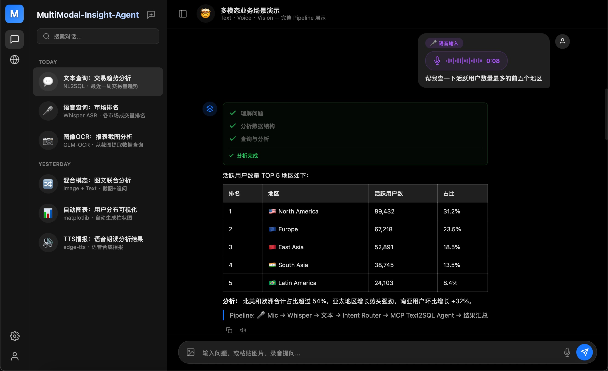
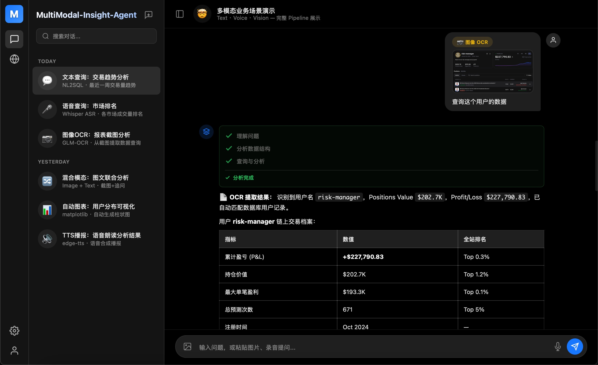

<div align="center">

# MultiModal Insight Agent

### 💬 Text · 🎤 Voice · 📷 Vision → MCP Tools → Database Insight
### 💬 文本 · 🎤 语音 · 📷 图像 → MCP 工具链 → 数据洞察

A full-stack **multimodal AI agent**: any input modality — **natural language**, **voice**, or **image** — is unified into an **LLM agentic loop** that orchestrates **MCP tool calls** (`find_tables` → `get_schema` → `run_sql`) to query real databases, then streams back structured results with auto-generated charts and voice narration.

全栈**多模态 AI Agent**：任意输入模态（**自然语言**、**语音**、**图像**）统一进入 **LLM Agent 循环**，编排 **MCP 工具调用**（`find_tables` → `get_schema` → `run_sql`）查询真实数据库，以 SSE 流式返回结构化结果、自动图表和语音播报。

[](https://python.org)
[](https://fastapi.tiangolo.com)
[](https://modelcontextprotocol.io/)
[](https://developer.mozilla.org/en-US/docs/Web/JavaScript)
[](LICENSE)

<br/>



</div>

---

## Core Idea / 核心理念

> **Three input modalities, one unified MCP tool chain, one intelligent answer.**
> 
> **三种输入模态，一条统一的 MCP 工具链，一个智能答案。**

```
  💬 Type          🎤 Speak           📷 Snap
    │                │                  │
    │           Whisper ASR        GLM-OCR / Vision
    │                │                  │
    └────────────────┴──────────────────┘
                     │
              ┌──────▼──────┐
              │ Intent Router│  LLM classifies intent
              └──────┬──────┘
                     │
              ┌──────▼──────────────────────┐
              │   MCP Tool Chain (3 tools)   │
              │                              │
              │   1. find_tables()           │
              │   2. get_table_schema()      │
              │   3. run_public_sql_query()  │
              └──────┬──────────────────────┘
                     │
              ┌──────▼──────┐
              │  SSE Stream  │  3-step progress + word-by-word
              └──────┬──────┘
                     │
         ┌───────────┼───────────┐
         ▼           ▼           ▼
    📊 Auto Chart  📝 Answer   🔊 TTS
```

| 模态 Modality | 处理流程 Pipeline | MCP 参与度 |
|:---:|:---|:---:|
| **💬 文本 Text** | 自然语言 → 意图路由 → **Text2SQL Agent Loop** → MCP `find_tables` → `get_schema` → LLM 生成 SQL → MCP `run_sql_query` → 结果+洞察 | ✅ **完整 3 工具** |
| **🎤 语音 Voice** | 浏览器麦克风 → Whisper ASR → 转录文本 → **与文本相同的 MCP 流程** | ✅ **完整 3 工具** |
| **📷 图像 OCR** | 上传/粘贴 → GLM-OCR 提取文本 → 重路由为 text_query → **MCP 流程** | ✅ **完整 3 工具** |
| **📷 图像 Vision** | 未发现文本 → GPT-4o Vision 直接分析图表/照片 | ❌ 仅 Vision |
| **🔀 混合 Mixed** | 图片 + 文字 → OCR 提取上下文 + 用户问题 → **组合 MCP 查询** | ✅ **完整 3 工具** |

输出以 **SSE 流** 返回，包含实时 3 步进度指示器和逐字渲染 — 用户可以看到 Agent 的*思考过程*。

The output flows back as **SSE stream** with a real-time 3-step progress indicator, then word-by-word response rendering — the user watches the agent *think*.

---

## Demo / 演示 — Multimodal Scenarios / 多模态场景

<table>
<tr>
<td width="50%"><br/><em>🎤 语音输入 → Whisper ASR → MCP 工具链 → 表格结果<br/>Voice input → Whisper ASR → MCP tool chain → table results</em></td>
<td width="50%"><br/><em>📷 图像 OCR → GLM-OCR 提取 → MCP 流程 → 用户数据分析<br/>Image OCR → GLM-OCR extract → MCP pipeline → user data analysis</em></td>
</tr>
</table>

---

## Why This Project? / 为什么做这个项目？

Most "chat with your database" demos are **text-only** and **single-shot**. Real-world data workflows need **multimodal input** funneled through **reliable tool orchestration**.

大多数"对话式查询数据库"只支持**纯文本**和**单轮调用**。真实数据工作流需要**多模态输入**通过**可靠的工具编排**来处理：

| 现有方案的不足 Gap | 本项目的解决方式 Solution |
|:---|:---|
| 仅文本输入 Text-only | **3 种模态** — 打字、语音、截图 |
| 单次 LLM 调用 Single call | **MCP Agent 循环** — 多步骤：发现 schema → 生成 SQL → 执行 → 自动重试 → 汇总 |
| 黑盒响应 Black-box | **SSE 流式 + 3 步进度** — 用户实时看到每次 MCP 工具调用 |
| 玩具 SQLite Toy DB | **生产级 PostgreSQL** — MCP 工具链，强制只读安全 |
| 无多模态融合 No fusion | **混合模式** — 图片 OCR 上下文 + 用户文字 → 组合 MCP 查询 |
| 无输出模态 No output | **自动图表** (matplotlib) + **TTS 语音播报** (edge-tts) |

**MultiModal Insight Agent** = 多模态输入层 + LLM 意图路由 + MCP 工具链 + 流式输出 — 自包含全栈应用。

---

## Multimodal → MCP Pipeline Deep Dive / 多模态 → MCP 管线详解

Every modality ultimately converges on the **same MCP tool chain**. This is the key design principle.

每种模态最终都汇入**同一条 MCP 工具链**。这是核心设计原则。

### 🎤 Voice → MCP / 语音 → MCP

```
Browser mic (WebRTC MediaRecorder)
  → audio blob → POST /v1/audio/transcriptions
  → Whisper ASR → transcribed text
  → ⚡ enters the same pipeline as typing
  → Intent Router → MCP find_tables → get_schema → run_sql_query
```

Voice is a **transparent input adapter** — after Whisper transcription, the text hits the exact same MCP agent loop as direct typing. Zero special handling.

语音是**透明的输入适配器** — Whisper 转录后，文本进入与直接打字完全相同的 MCP Agent 循环，零特殊处理。

### 📷 Image → MCP / 图像 → MCP

```
Paste / Upload image → base64
  → POST /v1/chat/completions (multimodal)
  │
  ├── GLM-OCR layout_parsing → extracted text?
  │   ├── YES → re-route as text_query → ⚡ MCP tool chain
  │   └── NO  → GPT-4o Vision (chart/photo analysis, no MCP)
  │
  └── Mixed mode (image + user text):
      → OCR extracts context + user question
      → combined query → ⚡ MCP tool chain
```

**Key insight**: OCR converts image into text, which then enters the MCP pipeline — the agent doesn't know the query originated from an image.

**核心洞察**：OCR 将图像转换为文本，然后进入 MCP 管线 — Agent 不知道查询源自一张图片。

### 💬 Text → MCP (Core Agent Loop) / 文本 → MCP（核心 Agent 循环）

```
"What are the top markets by volume?"
  → Intent Router (LLM classify → text_query)
  │
  → MCP Agent Loop (max 12 steps):
  │   Step 1: MCP find_tables()         → discover available tables
  │   Step 2: MCP get_table_schema()    → column definitions + types
  │   Step 3: LLM generates SQL         → SELECT ... FROM ... 
  │   Step 4: MCP run_public_sql_query()→ execute (read-only enforced)
  │   Step 5: Error? LLM fixes SQL      → auto-retry (max 2)
  │   Step 6: LLM summarizes results    → natural language answer
  │
  → Optional: auto-chart (matplotlib bar/line/hbar)
```

### 🔊 MCP Results → Voice (TTS Output) / MCP 结果 → 语音输出

```
Agent answer → click 🔊 → POST /v1/audio/speech
  → edge-tts (zh-CN-XiaoxiaoNeural) → MP3 stream → browser playback
```

`getVoiceText()` strips markdown/code/tables, extracts a voice-friendly summary for narration.

`getVoiceText()` 去除 markdown/代码/表格，提取适合语音朗读的摘要。

---

## Architecture / 架构

```
┌───────────────────────────────────────────────────────────────┐
│                       Browser (Frontend)                      │
│                                                               │
│  ┌──────────┐   ┌──────────┐   ┌──────────┐   ┌──────────┐  │
│  │   Text   │   │  Voice   │   │  Image   │   │   Chat   │  │
│  │  Input   │   │ 🎤 Mic   │   │ 📷 Paste │   │    UI    │  │
│  │          │   │ Whisper  │   │  Upload  │   │          │  │
│  └────┬─────┘   └────┬─────┘   └────┬─────┘   └────┬─────┘  │
│       │              │              │               │         │
│       └──────────────┴──────────────┴───────────────┘         │
│                          │ SSE + fetch                        │
└──────────────────────────┼────────────────────────────────────┘
                           │
              ┌────────────▼────────────┐
              │     serve.py (:3210)    │
              │  Static + /v1/* proxy   │
              │  Raw-socket SSE fwd     │
              └────────────┬────────────┘
                           │
              ┌────────────▼────────────┐
              │  FastAPI Backend (:8000) │
              │                         │
              │  ┌─────────────────┐    │
              │  │  Intent Router  │    │
              │  │  (LLM classify) │    │
              │  └───┬───┬───┬────┘    │
              │      │   │   │          │
              │  ┌───▼┐ ┌▼──┐ ┌▼─────┐  │
              │  │Text│ │VLM│ │Mixed │  │
              │  │2SQL│ │OCR│ │Query │  │
              │  └─┬──┘ └─┬─┘ └──┬───┘  │
              │    │      │      │       │
              │  ┌─▼──────▼──────▼────┐  │
              │  │    MCP Tools       │  │
              │  │  find_tables       │  │
              │  │  get_table_schema  │  │
              │  │  run_sql_query     │  │
              │  └────────┬───────────┘  │
              │           │              │
              │  ┌────────▼───────────┐  │
              │  │ PostgreSQL / SQLite│  │
              │  └────────────────────┘  │
              │                         │
              │  ┌── Modality Layer ──┐  │
              │  │ 🎤 ASR (Whisper)   │  │
              │  │ 🔊 TTS (edge-tts)  │  │
              │  │ 👁️ Vision (GPT-4o)  │  │
              │  │ 📄 OCR (GLM-OCR)   │  │
              │  │ 📊 Chart (mpl)     │  │
              │  └────────────────────┘  │
              └─────────────────────────┘
```

---

## Features / 功能特性

### Multimodal Input → MCP → Output / 多模态输入 → MCP → 输出

| 模态 Modality | 方向 | 处理流程 Flow | MCP? |
|:---|:---:|:---|:---:|
| **💬 文本 Text** | 输入 | 自然语言 → 意图路由 → Text2SQL Agent → MCP 3 工具链 | ✅ 完整 |
| **🎤 语音 Voice** | 输入 | 麦克风 → Whisper ASR → 文本 → **同 MCP 流程** | ✅ 完整 |
| **📷 图像 OCR** | 输入 | 图像 → GLM-OCR → 提取文本 → 重路由 → **MCP 流程** | ✅ 完整 |
| **📷 图像 Vision** | 输入 | 图像 → GPT-4o Vision → 图表/照片分析 | ❌ 仅 Vision |
| **🔀 混合 Mixed** | 输入 | 图片+文字 → OCR 上下文+问题 → **组合 MCP 查询** | ✅ 完整 |
| **📊 图表 Chart** | 输出 | MCP 查询结果 → matplotlib 自动图表 | MCP 后处理 |
| **🔊 语音 Speech** | 输出 | MCP 回答 → edge-tts 神经语音合成 → MP3 播放 | MCP 后处理 |

### MCP Tool Chain (Core) / MCP 工具链（核心）

| 工具 Tool | 功能 Function | 安全性 Safety |
|:---|:---|:---|
| `find_tables()` | 发现数据库中所有可用表 Discover all tables | 只读 Read-only |
| `get_table_schema()` | 获取表的列名、类型和约束 Get columns + types | 只读 Read-only |
| `run_public_sql_query()` | 执行 SQL 并返回行（最多 500）Execute SQL + rows | **强制只读** — 禁止 INSERT/UPDATE/DELETE |

Agent 在一个**循环**中调用这些工具（最多 12 步，SQL 错误自动重试 2 次），由 LLM 根据对话历史决定下一步调用哪个工具。

The agent calls these tools in a **loop** (max 12 steps, 2 auto-retries on SQL error), guided by an LLM that decides which tool to call next.

### Backend Capabilities / 后端能力

| 能力 Capability | 描述 Description |
|:---|:---|
| **Text2SQL Agent** | LLM Agent 循环：分析 → MCP 发现 schema → 生成 SQL → MCP 执行 → 错误自动重试 → 汇总 |
| **意图路由 Intent Router** | LLM 分类器分发到 `text_query` / `vision_analysis` / `mixed` / `general_chat` — 决定 MCP 参与度 |
| **OCR → MCP 桥接** | GLM-OCR 提取文本 → 意图重路由 → 透明进入 MCP 管线 |
| **SSE + MCP 事件** | 每次 MCP 工具调用发出 `start`/`done` 事件 → 前端实时 3 步进度 |
| **双 DB 模式** | `sqlite` 本地演示（零配置），`mcp` 连接生产级 PostgreSQL |
| **Mock 模式** | 无需任何 API key 即可运行完整管线（`LLM_MODE=mock`） |

### Frontend / 前端

| 功能 Feature | 描述 Description |
|:---|:---|
| **零构建 Zero Build** | 纯 HTML/CSS/JS — 无 npm，无打包器，即时启动 |
| **SSE 客户端** | 基于 ReadableStream 的解析器，增量 DOM 更新 |
| **3 步进度** | 实时步骤指示器：⏳ 理解问题 → ✓ 分析数据结构 → ✓ 查询与分析 |
| **语音录制** | 浏览器内麦克风采集 → Whisper 转录 → 自动填入输入框 |
| **图像上传** | 剪贴板粘贴或文件选择 → 预览 → 多模态 API 调用 |
| **多会话** | 创建、置顶、搜索、切换对话 |
| **暗色优先 UI** | CSS 自定义属性，粒子动画，3D Logo |

---

## Quick Start / 快速开始

### 1. Clone & Configure / 克隆与配置

```bash
git clone https://github.com/Alexin09/multimodal-insight-agent.git
cd multimodal-insight-agent

# 创建配置文件（包含 API 密钥 — 不会被提交）
# Create your config (contains API keys — never committed)
cp backend/.env.example backend/.env
```

编辑 `backend/.env` / Edit `backend/.env`:

```env
# === 最小配置（立即可用）Minimal config (works immediately) ===
LLM_MODE=mock        # 无需 API key！No API key needed for demo!
DB_MODE=sqlite       # 本地演示数据库 Local demo database

# === 完整配置（真实 LLM + OCR）Full config ===
LLM_MODE=openai
OPENAI_BASE_URL=https://api.moonshot.cn/v1
OPENAI_API_KEY=sk-your-key-here
OPENAI_MODEL=kimi-k2.5

# OCR — 启用图像文本提取（可选）enables image text extraction (optional)
ZHIPU_API_KEY=your-zhipu-api-key-here
```

### 2. One-Command Start / 一键启动

```bash
chmod +x start.sh
./start.sh
```

启动后会 / This will:
1. 创建 Python venv 并安装依赖（仅首次）Create venv + install deps (first run only)
2. 启动 FastAPI 后端 `:8000` / Start FastAPI backend
3. 启动前端代理 `:3210` / Start frontend proxy

打开 **http://localhost:3210** — 完成。That's it.

### 3. Manual Start (Alternative) / 手动启动

```bash
# 终端 1：后端 Terminal 1: Backend
cd backend
python3 -m venv .venv && .venv/bin/pip install -r requirements.txt
.venv/bin/python server.py

# 终端 2：前端代理 Terminal 2: Frontend proxy
python3 serve.py
```

---

## Try It / 试试看

| 功能 What to try | 操作方式 How |
|:---|:---|
| **💬 文本查询** Text query | 输入 "交易量前5的市场？" → 观看 3 步进度 → 获取结果 |
| **🎤 语音输入** Voice input | 点击 🎤 麦克风 → 说出问题 → 松开 → 自动转录并发送 |
| **📷 图像 OCR** | 截图数据表 → 粘贴 (Ctrl+V) 到聊天 → OCR 提取文本 → 自动查询 |
| **👁️ 图像分析** Image analysis | 上传图表截图 → GPT-4o Vision 描述趋势和异常 |
| **🔊 TTS 播报** | 获得回答后点击 🔊 按钮 → 听语音朗读结果 |
| **📊 图表生成** Chart | 问 "展示交易量趋势" → 自动生成图表 |

---

## Project Structure / 项目结构

```
multimodal-insight-agent/
├── index.html                    # SPA shell — sidebar nav, 4 pages
├── styles.css                    # Dark-theme design system
├── app.js                        # Page routing, sessions, settings, market UI
├── chat.js                       # SSE client, tool-call parser, ASR/TTS, markdown
├── serve.py                      # HTTP proxy with raw-socket SSE forwarding
├── logo.png                      # App logo
├── start.sh                      # One-command launcher
│
├── backend/
│   ├── server.py                 # FastAPI — /v1/chat/completions, /v1/audio/*, /health
│   ├── requirements.txt          # Python dependencies
│   ├── .env.example              # Config template (API keys, DB credentials)
│   │
│   ├── core/                     # ← Agent brain
│   │   ├── router.py             #   LLM intent classification (4 intents)
│   │   ├── text2sql.py           #   Agent loop: schema → SQL → execute → summarize
│   │   ├── llm_client.py         #   OpenAI client with mock/real dual mode
│   │   ├── mcp_client.py         #   MCP tool wrappers with pipeline event emission
│   │   ├── pipeline_events.py    #   AsyncIO event queue for SSE tool-call streaming
│   │   └── db.py                 #   DB abstraction: SQLite (demo) or PostgreSQL (MCP)
│   │
│   ├── mcp/                      # ← MCP tool chain (the core)
│   │   ├── tools.py              #   3 tools: find_tables, get_schema, run_sql
│   │   └── db.py                 #   PostgreSQL connection + read-only safety
│   │
│   ├── modality/                 # ← Multimodal adapters (all feed into MCP)
│   │   ├── asr.py                #   🎤 Whisper ASR → text → MCP
│   │   ├── tts.py                #   🔊 edge-tts (MCP results → voice)
│   │   ├── vision.py             #   👁️ GPT-4o Vision analysis
│   │   ├── zhipu_ocr.py          #   📄 GLM-OCR → text → MCP
│   │   └── chart.py              #   📊 matplotlib (MCP results → chart)
│
│
├── showcase/                     # Static demo page (multimodal scenarios)
│   ├── index.html                #   Chat UI with 5 demo conversations
│   └── ocr-input.png             #   Sample OCR input image
│
├── docs/                         # Screenshots for README
└── LICENSE
```

---

## How It Works / 工作原理

### Multimodal → MCP Pipeline Flow / 多模态 → MCP 管线流程

```
  💬 Text        🎤 Voice          📷 Image           🔀 Image + Text
    │              │                  │                     │
    │         Whisper ASR         GLM-OCR              OCR + user text
    │              │                  │                     │
    │              ▼                  ▼                     ▼
    │         transcribed         extracted text       combined query
    │           text                  │                     │
    └──────────────┴──────────────────┴─────────────────────┘
                                  │
                   ┌──────────────▼──────────────┐
                   │  Intent Router (LLM classify)│
                   │  → text_query | mixed |      │
                   │    vision_analysis | general  │
                   └──────────────┬──────────────┘
                                  │
                   ┌──────────────▼──────────────┐
                   │   MCP Agent Loop (LLM)       │
                   │   max 12 steps, 2 retries    │
                   │                              │
                   │   1. MCP find_tables()       │──→ available tables
                   │   2. MCP get_table_schema()  │──→ columns + types
                   │   3. LLM generates SQL       │
                   │   4. MCP run_sql_query()     │──→ execute + rows
                   │   5. SQL error? LLM fixes    │──→ retry
                   │   6. LLM summarizes          │──→ answer
                   └──────────────┬──────────────┘
                                  │
                   ┌──────────────▼──────────────┐
                   │  SSE Stream to Frontend       │
                   │  ✓ 理解问题                   │
                   │  ✓ 分析数据结构               │
                   │  ✓ 查询与分析                 │
                   └──────────────┬──────────────┘
                                  │
                    ┌─────────────┼─────────────┐
                    ▼             ▼             ▼
              📊 Auto Chart   📝 Answer    🔊 TTS
```

### SSE + MCP Event Streaming / SSE + MCP 事件流

The streaming pipeline is the project's core innovation — **every MCP tool call is visible to the user in real-time**.

流式管线是项目的核心创新 — **每次 MCP 工具调用都实时可见**：

1. **后端 Backend** — `asyncio.Queue` 将 MCP 工具事件与 SSE 输出解耦
2. **MCP 事件** — 每次工具调用（`find_tables`、`get_schema`、`run_sql`）发出 `start`/`done` 事件
3. **SSE 生成器** — 排空队列，以 OpenAI 兼容格式输出 `<details type="tool_calls">` 块
4. **代理 Proxy** — `serve.py` 在 TCP 层解除 `Transfer-Encoding: chunked`（原始 socket，零缓冲）
5. **前端 Frontend** — `ReadableStream` 解析 SSE，渲染 3 步 MCP 进度：
   ```
   ✓ 理解问题          ← classify_intent done
   ✓ 分析数据结构      ← MCP schema_discovery done
   🔄 查询与分析...     ← MCP agent.reasoning in progress
   ```

结果：用户**实时**看到每次 MCP 工具调用，观看 Agent 思考过程。

Result: the user sees each MCP tool call **in real-time** as the agent thinks.

---

## Supported LLM Providers / 支持的 LLM 提供商

Any OpenAI-compatible API works. 任何 OpenAI 兼容 API 均可使用：

| Provider | `OPENAI_BASE_URL` | `OPENAI_MODEL` |
|:---|:---|:---|
| **Kimi (Moonshot)** | `https://api.moonshot.cn/v1` | `kimi-k2.5` |
| **OpenAI** | `https://api.openai.com/v1` | `gpt-4o` |
| **DeepSeek** | `https://api.deepseek.com/v1` | `deepseek-chat` |
| **Ollama** | `http://localhost:11434/v1` | `llama3.1` |
| **vLLM** | `http://localhost:8000/v1` | Your model |
| **Mock** | *(any)* | Set `LLM_MODE=mock` |

---

## Tech Stack / 技术栈

| 层 Layer | 技术 Technology | 选型理由 Why |
|:---|:---|:---|
| **后端 Backend** | FastAPI + Uvicorn | 异步原生，SSE 流式，OpenAI 兼容 API |
| **LLM** | OpenAI Python SDK | 通用客户端，兼容所有提供商 |
| **数据库 Database** | PostgreSQL / SQLite | 生产+本地演示双模式 |
| **MCP 工具** | 自定义 3 工具链 | Schema 发现 + 安全只读 SQL 执行 |
| **ASR 语音识别** | OpenAI Whisper | 业界标准多语言语音识别 |
| **TTS 语音合成** | edge-tts | 免费神经语音合成 — 50+ 声音，无需 API key |
| **OCR 文字识别** | ZhipuAI GLM-OCR | 高质量版面解析 OCR（中英文） |
| **Vision 视觉** | GPT-4o Vision | 图表分析、表格提取、图像理解 |
| **图表 Charts** | matplotlib | 查询结果自动生成 PNG 图表 |
| **前端 Frontend** | Vanilla JS (ES2022) | 零依赖，即时加载，完全掌控 |
| **样式 Styling** | CSS Custom Properties | 暗色主题系统，流畅动画 |
| **代理 Proxy** | Python raw sockets | TCP 层 SSE chunked transfer 解块 |

---

## Configuration Reference / 配置参考

### `backend/.env`

| 变量 Variable | 默认值 Default | 说明 Description |
|:---|:---|:---|
| `LLM_MODE` | `mock` | `mock` 演示模式（无需 API key），`openai` 真实 LLM |
| `OPENAI_BASE_URL` | — | LLM API 地址 |
| `OPENAI_API_KEY` | — | LLM API 密钥 |
| `OPENAI_MODEL` | `gpt-4o` | 模型名称 |
| `ZHIPU_API_KEY` | — | ZhipuAI 密钥，用于 GLM-OCR 图像文字提取（可选） |
| `DB_MODE` | `sqlite` | `sqlite` 本地演示，`mcp` 连接 PostgreSQL |
| `DB_HOST` | `localhost` | PostgreSQL 主机 |
| `DB_PORT` | `5432` | PostgreSQL 端口 |
| `DB_NAME` | — | 数据库名 |
| `DB_USER` | — | 数据库用户 |
| `DB_PASSWORD` | — | 数据库密码 |
| `DB_SCHEMA` | `public` | PostgreSQL schema |
| `QUERY_TIMEOUT` | `60` | SQL 查询超时（秒） |
| `MAX_ROWS` | `500` | 每次查询最大返回行数 |
| `PORT` | `8000` | 后端服务端口 |

---

## Extending / 扩展

### Add New MCP Tools / 添加新 MCP 工具

1. 在 `backend/mcp/tools.py` 中添加工具函数
2. 在 `backend/core/mcp_client.py` 中包装并发出事件
3. 在 `backend/core/text2sql.py` 的 Agent system prompt 中注册
4. 在 `app.js` → `MCP_TOOLS` 数组中添加 UI 卡片
5. 在 `chat.js` → `STEP_NAMES` 中添加显示名称

### Connect Your Own Database / 连接自己的数据库

1. 在 `.env` 中设置 `DB_MODE=mcp`
2. 填写你的 PostgreSQL 凭据
3. 在 `text2sql.py` 中更新 Agent system prompt，描述你的表结构

### Add New Modalities / 添加新模态

`backend/modality/` 目录设计为插件层：
- 每个文件暴露统一接口的 async 函数
- `server.py` 根据意图路由的决定编排调用
- 添加新文件（如 `pdf.py`）并接入 `server.py` 即可

---

## Roadmap / 路线图

- [ ] IndexedDB 持久化会话 Persistent sessions
- [ ] ECharts 集成更丰富的交互式可视化
- [ ] 文件上传（CSV/Excel）即席分析
- [ ] 多语言 UI (i18n)
- [ ] Docker Compose 一键部署
- [ ] 对话记忆 + RAG
- [ ] PDF 文档解析模态

---

## License

[MIT](LICENSE)

---

<div align="center">

**Any modality in → MCP tool chain → database insight out.**

**任意模态输入 → MCP 工具链 → 数据洞察输出。**

*💬 文本 · 🎤 语音 · 📷 图像 — 通过 MCP `find_tables` → `get_schema` → `run_sql` 统一 — 以图表和语音流式返回。*

</div>
